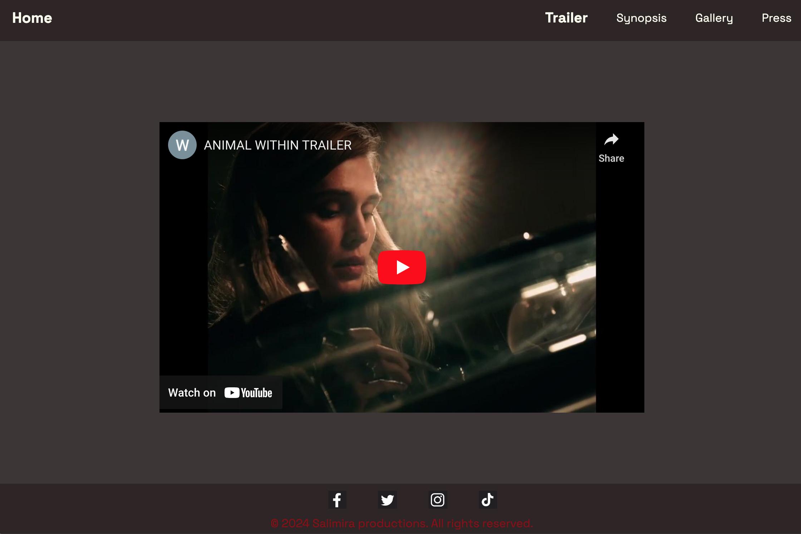
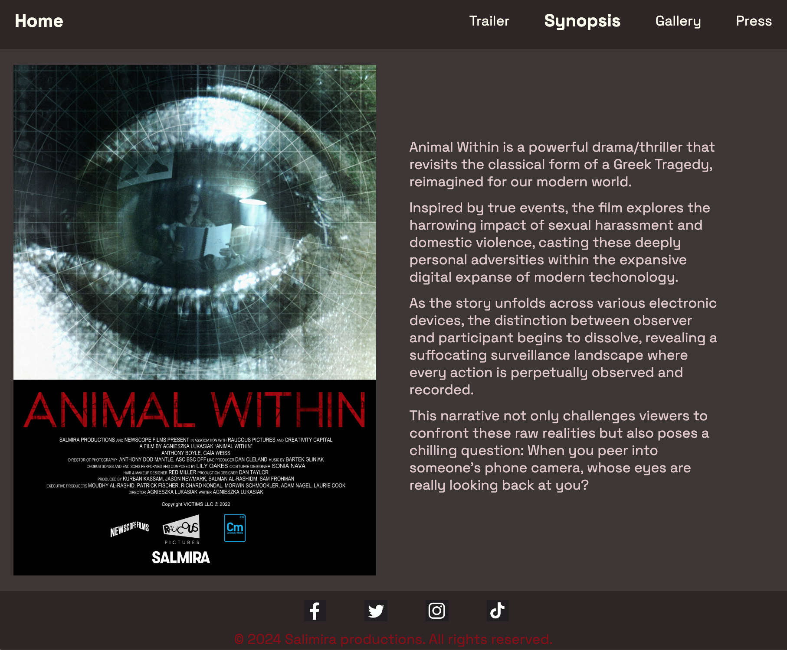

# Project-1
Code Institute webpage project 1

ANIMAL WITHIN
The Animal Within official website is dedicated to promoting the film and providing comprehensive information to fans and potential viewers. The site is designed to be the primary online destination for everything related to the movie, from release details to exclusive content and community engagement.

## Existing Features

### Navigation Bar

- Featured on all five pages, the responsive navigation bar includes links to the Home page, Synopsis, Trailer, Gallery, and PR inquiries, and is identical on each page to make navigation easy.

- This navigation bar makes it easy to navigate from page to page without having to use the "back" button.

<!--PHOTO-->

### The Footer

- The footer includes links to the relevant social media sites for Animal Within. The links will open in a new tab to allow easy navigation for the user.
	
- The footer encourages the user to stay updated about the film via social media, share it with their friends, and engage with the fan community.

<!--PHOTO-->

### The landing page 

 - The landing page includes a poster, the title, and a credit list. It also includes information about the "selected cinema release" and a button to allow the user to watch the trailer without having to go through the trouble of looking for it on the navigation bar, prompting a more instinctual navigation.

- This section introduces Animal Within with an eye-catching poster to capture users attention and prompts the user to watch the trailer.

<!--PHOTO-->

### The	Trailer page

-  On the trailer page, the user will have an opportunity to watch the official trailer for the movie.

- This section is valuable to the user as they will be able to easily identify what the movie is about, it's form and style, which will prompt them to want to watch it .

<!--PHOTO-->

### The Synopsis page

-  The synopsis section allows the user to quickly get an overview of the film's content and unique selling points while also being able to view the second official poster, providing a better idea of the film.
	
- The user will understand the uniqueness of the form and the storyline of the film, which should encourage them to want to watch it.

<!--PHOTO-->

### Gallery

- The gallery, is a scroll down page, that will provide the user with images from Animal Within to give them a better feel for the movie.

- This section is valuable to the user as they will be able to easily identify what type of film this is and get intrigued by the unique visual styling of the movie.

<!--PHOTO-->

### Pr Inquiries

-  The press inquiry page provides a form where any press inquiries can be submitted by the user.

- This form allows media, distributors, and other interested parties to request press materials, interviews, and more information about the film. Once the inquiry is submitted, the relevant PR team will respond via email. This makes it easy for the media to contact the PR agents for the film and get the information and materials they need.

<!--PHOTO-->

	
### Features Left to Implement

- Adding another official trailer.
Adding a form where the user can enter their location to find out which cinemas in their city are playing the film and when.

### Testing

The webpage for Animal Within works on various devices and screen sizes.
There are initial problems with the size of the official posters, which do not work well for the web. This will be addressed by designing a new poster specifically for the web, so it can be easily rescaled to various screen sizes and devices.
Currently, the form on the press inquiry page doesn’t send inquiries, as there is no backend for this page yet. This will be addressed at a later stage.
The social media links are currently linked to my private accounts or just to the platform itself (if I don’t have an account on that platform). This is just to illustrate that the links work. Since the movie’s social media accounts are not yet properly set up, this will need to be addressed at a later stage.

### Validator Testing

#### HTML
- No errors were returned when passing through the official W3C validator, except the ones described in the bug section bellow.

Link to validation:
Landing page: https://validator.w3.org/nu/?doc=https%3A%2F%2Fagnieszkalukasiak.github.io%2FProject-1%2Findex.html

Synopsis page: https://validator.w3.org/nu/?doc=https%3A%2F%2Fagnieszkalukasiak.github.io%2FProject-1%2Fsynopsis.html

Galery page: https://validator.w3.org/nu/?showsource=yes&showoutline=yes&showimagereport=yes&doc=https%3A%2F%2Fagnieszkalukasiak.github.io%2FProject-1%2Fgallery.html

Trailer page: https://validator.w3.org/nu/?doc=https%3A%2F%2Fagnieszkalukasiak.github.io%2FProject-1%2Ftrailer.html

Press page: https://validator.w3.org/nu/?doc=https%3A%2F%2Fagnieszkalukasiak.github.io%2FProject-1%2Fpress.html

#### CSS
- No errors were found when passing through the official (Jigsaw) validator.
Link to validation:
https://jigsaw.w3.org/css-validator/validator?uri=https%3A%2F%2Fagnieszkalukasiak.github.io%2FProject-1%2F&profile=css3svg&usermedium=all&warning=1&vextwarning=&lang=en

### Unfixed Bugs

There are no bugs.

### Deployment

- The site was deployed to GitHub pages. The steps to deploy are as follows:
- In the GitHub repository, navigate to the Settings tab
- From the source section drop-down menu, select the Master Branch
- Once the master branch has been selected, the page will be automatically refreshed with a detailed ribbon display to indicate the successful deployment.

The live link can be found here : https://agnieszkalukasiak.github.io/Project-1/index.html

### CREDITS

-  The code for scaling video files: https://www.w3schools.com/css/css_rwd_videos.asp
-  Got help from my mentor, Moritz Wach.
- Asked ChatGPT for help with the code to scale the poster and make it responsive, but had to alter that code.
- The code for positioning: https://stackoverflow.com/questions/5222523/position-a-div-container-on-the-right-side
- The code for adding photos to read me : https://stackoverflow.com/questions/10189356/how-to-add-screenshot-to-readmes-in-github-repository
- Got help from the Code Institute Slack community.
- got help with wrap code:https://stackoverflow.com/questions/5222523/position-a-div-container-on-the-right-side

### Content
- The text from the synopsis page was written for the film by Kurban Kassam.
- Instructions on how to implement form validation on the Sign Up page were taken from Specific YouTube Tutorial.
- The icons in the footer were taken from Font Awesome.

### Media
- The photos used on the home and gallery pages are from my film, photographed by Anthony Dod Mantle.
- The posters on the home page and synopsis page were created by Live Nation, Andy Peters.
- Favicons taken from: Adobe Stock.
- Trailer video taken from open source: YouTube.
- The icons in the footer were taken from Buffer Library.

